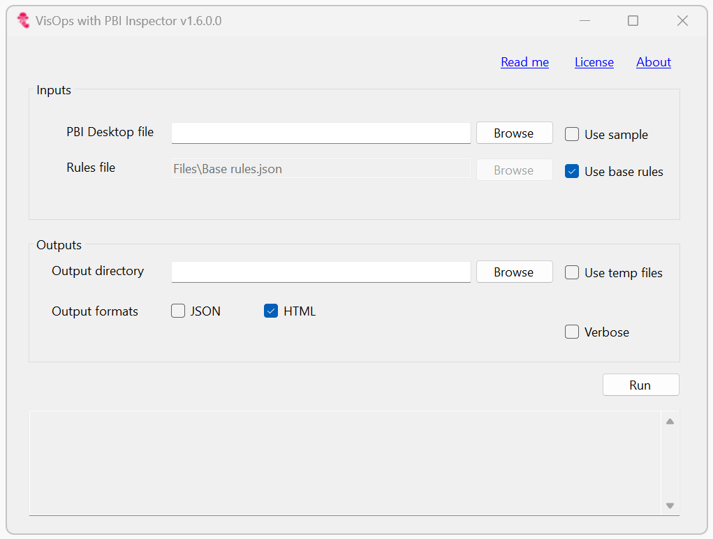
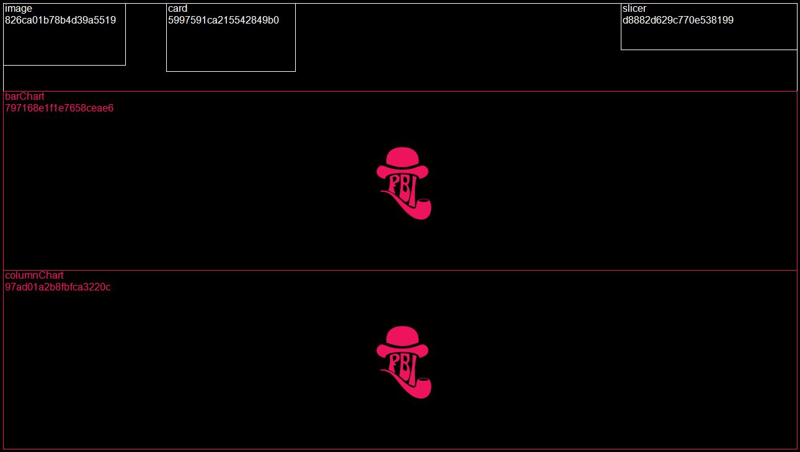
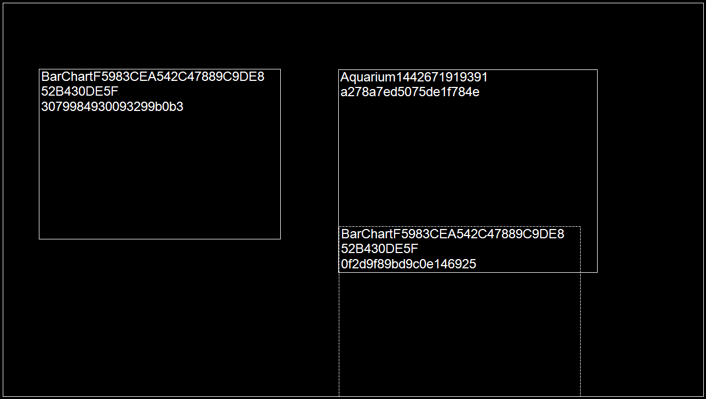
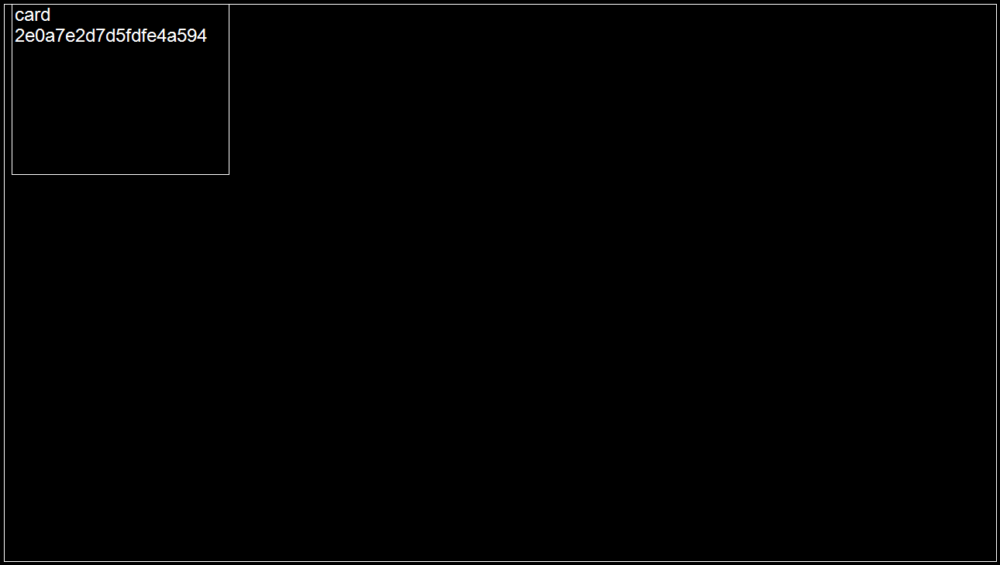

# VisOps with PBI Inspector (i.e. automated visual layer testing for Microsoft Power BI)


## NOTE :pencil:

This is a community project that is not supported by Microsoft. 

This version of PBI Inspector only supports the new enhanced metadata file format (PBIR), see https://learn.microsoft.com/en-gb/power-bi/developer/projects/projects-report. For the older PBIR-legacy file format, please use the previous version of PBI Inspector available at https://github.com/NatVanG/PBI-Inspector.

## Thanks :pray:

Thanks to [Michael Kovalsky](https://github.com/m-kovalsky) and [Rui Romano](https://github.com/ruiromano) for their feedback on this project. Thanks also to [Luke Young](https://www.linkedin.com/in/luke-young-2301/) for creating the PBI Inspector logo.

## Bugs :beetle:

Please report issues [here](https://github.com/NatVanG/PBI-Inspector/issues).

## <a name="contents"></a>Contents

- [Intro](#intro)
- [Base rules](#baserulesoverview)
- [Run from the Graphical user interface](#gui)
- [Run from the Command line](#cli)
- [Interpreting results](#results)
- [Running reports on reports](#reporting)
- [Known issues](#knownissues)
- [Report an issue](#reportanissue)

## <a id="intro"></a>Intro

So we've DevOps, MLOps and DataOps... but why not VisOps? How can we ensure that business intelligence charts and other visuals within report pages are published in a consistent, performance optimised and accessible state? For example, are local report settings set in a consistent manner for a consistent user experience? Are visuals deviating from the specified theme by, say, using custom colours? Are visuals kept lean so they render quickly? Are charts axes titles displayed? etc.

With Microsoft Power BI, visuals are placed on a canvas and formatted as desired, images may be included and theme files referenced. Testing the consistency of the visuals output has thus far typically been a manual process. Recently, a [new Power BI file format (.pbip) was introduced](https://powerbi.microsoft.com/en-us/blog/deep-dive-into-power-bi-desktop-developer-mode-preview/) to enable pro developer application lifecycle management and source control. In particular, the report's layout definition and any associated theme are in json format and therefore readable by both machines and humans. However upon new releases of Power BI, the json structure may introduce changes without warning to include new features for example. Therefore an automated visual layout testing tool should be resilient to such changes while providing a powerful rule logic creation framework. PBI Inspector provides the ability to define fully configurable testing rules (themselves written in json) powered by Greg Dennis's Json Logic .NET implementation, see https://json-everything.net/json-logic. 

### YouTube session with Reid Havens

[](https://www.youtube.com/watch?v=Moxci_B7kv8)

The rules files used in the session can be found at [Reid-rules.json](DocsExamples/Reid-rules.json). 

## <a id="baserulesoverview"></a>Base rules

While PBI Inspector supports custom rules, it also includes the following base rules defined at https://github.com/NatVanG/PBI-Inspector/blob/part-concept/Rules/Base-rulesV2.json, some rules allow for user parameters:

1. Remove custom visuals which are not used in the report (no user parameters)
2. Reduce the number of visible visuals on the page (set parameter ```paramMaxVisualsPerPage``` to the maximum number of allowed visible visuals on the page)
3. Reduce the number of objects within visuals (override hardcoded ```4``` parameter value the the maximum number of allowed objects per visuals)
4. Reduce usage of TopN filtering visuals by page (set ```paramMaxTopNFilteringPerPage```)
5. Reduce usage of Advanced filtering visuals by page (set ```paramMaxAdvancedFilteringVisualsPerPage```)
6. Reduce number of pages per report (set ```paramMaxNumberOfPagesPerReport```)
7. Avoid setting ‘Show items with no data’ on columns (no user parameters)
8. Tooltip and Drillthrough pages should be hidden (no user parameters)
9. Ensure charts use theme colours (no user parameters)
10. Ensure pages do not scroll vertically (no user parameters)
11. Ensure alternativeText has been defined for all visuals (disabled by default, no user parameters)

To modify parameters, save a local copy of the Base-rulesV2.json file at https://github.com/NatVanG/PBI-Inspector/blob/part-concept/Rules/Base-rulesV2.json and point PBI Inspector to the new file.

To disable a rule, edit the rule's json to specify ```"disabled": true```. At runtime PBI Inspector will ignore any disabled rule.

Currently these changes need to be made directly in the rules file json, however the plan is to provide a more intuitive user interface in upcoming releases of PBI Inspector.

## <a id="gui"></a>Run from the graphical user interface (GUI)

Running ```PBIXInspectorWinForm.exe``` presents the user with the following interface: 



1. Browse to your local PBI Desktop File, either the *.pbip file or its parent folder. 
2. Either use the base rules file included in the application or select your own.
3. Use the "Browse" button to select an output directory to which the results will be written. Alternatively, select the "Use temp files" check box to write the resuls to a temporary folder that will be deleted upon exiting the application.
4. Select output formats, either JSON or HTML or both. To simply view the test results in a formatted page select the HTML output.
5. Select "Verbose" to output both test passes and fails, if left unselected then only failed test results will be reported.  
6. Select "Run". The test run log messages are displayed at the bottom of the window. If "Use temp files" is selected (or the Output directory field is left blank) along with the HTML output check box, then the browser will open to display the HTML results.
7. Any test run information, warnings or errors are displayed in the console output textbox.

## <a id="cli"></a>Run from the command line interface (CLI)

All command line parameters are as follows:

```-pbip filepath```: Required. The path to the *.pbip file.

```-pbix filepath```: Not currently supported. 

```-rules filepath```: Required. The filepath to the rules file. Save a local copy of the base rules file at https://raw.githubusercontent.com/NatVanG/PBI-Inspector/main/Rules/Base-rules.json and modify as required.

```-verbose true|false```: Optional, false by default. If false then only rule violations will be shown otherwise all results will be listed.

```-output directorypath```: Optional. If -formats is set to either JSON, HTML or PNG, writes results to the specified directory, any existing files will be overwritten. If not supplied then a temporary directory will be created in the user's temporary files folder. 

```-formats CONSOLE,JSON,HTML,PNG,ADO```: Optional. Comma-separated list of output formats. 
- **CONSOLE** (default) writes results to the console output. If "-formats" is not specified then "CONSOLE" will be used by default.
- **JSON** writes results to a Json file.
- **HTML** writes results to a formatted Html page. If no output directory is specified and the HTML format is specified, then a browser page will be opened to display the HTML results. When specifying "HTML" format, report page wireframe images will be created so there is no need to also include the "PNG" format. 
- **PNG** draws report pages wireframes clearly showing any failing visuals. 
- **ADO** outputs Azure DevOps compatible task commands for use in a deployment pipeline. Task commands issued are "task.logissue" and "task.complete", see https://learn.microsoft.com/en-us/azure/devops/pipelines/scripts/logging-commands?view=azure-devops&tabs=bash#task-commands. PBI Inspector rules definition can be given a "logType" attribute of either "warning" or "error" which will be passed to the Azure DevOps task command as follows: ```##vso[task.logissue type=warning|error]```. When specifying "ADO" all other output format types will be ignored.

**Commmand line examples:**

- Run "Base-rules.json" rule definitions against PBI report file at "Sales.Report and return results in Json and HTML formats:

``` PBIXInspectorCLI.exe -pbip "C:\Files\Sales.pbip" -rules ".\Files\Base-rules.json" -output "C:\Files\TestRun" -formats "JSON,HTML"```

- Run "Base-rules.json" rule definitions against PBI report file at "Sales.Report and return results to the console only:

``` PBIXInspectorCLI.exe -pbip "C:\Files\Sales.pbip" -rules ".\Files\Base-rules.json" -output "C:\Files\TestRun" -formats "Console"```

- Run "Base-rules.json" rule definitions against PBI report file at "Sales.Report and return results as Azure DevOps compatible log and tasks commands (see https://learn.microsoft.com/en-us/azure/devops/pipelines/scripts/logging-commands?view=azure-devops&tabs=bash#task-commands):

``` PBIXInspectorCLI.exe -pbip "C:\Files\Sales.pbip" -rules ".\Files\Base-rules.json"  -formats "ADO"```

## <a id="results"></a>Interpreting results

 If a verbose output was requested, then results for both test passes and failures will be reported. The JSON output is intended to be consumed by a subsequent process, for example a Power BI report may be created that uses the JSON file as a data source and visualises the PBI Inspector test results. The HTML page is a more readable format for humans which also includes report page wireframe images when tests are at the report page level. These images are intended to help the user identify visuals that have failed the test such as the example image below. The PBI Inspector logo is also displayed at the centre of each failing visuals as an additional identification aid when the wireframe is busy. 



Visuals with a dotted border are visuals hidden by default as the following example:



## <a id="customrulesexamples"></a>Custom Rules Examples

Documentation is in progress.

## <a id="knownissues"></a>Known issues

-  Currently page wireframes are only created in a 16:9 aspect ratio so custom report page sizes including tooltip pages may not render as expected as shown in the following tooltip page example. See tooltip page example below:
 
 

 - Currently page wireframes do not faithfully represents the report page layout when visual groups are present.
 
 All issues should be logged at https://github.com/NatVanG/PBI-Inspector/issues.

## <a id="reportanissue"></a>Report an issue

Please report issues at https://github.com/NatVanG/PBI-Inspector/issues.