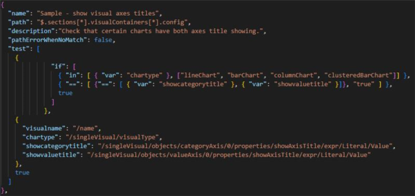
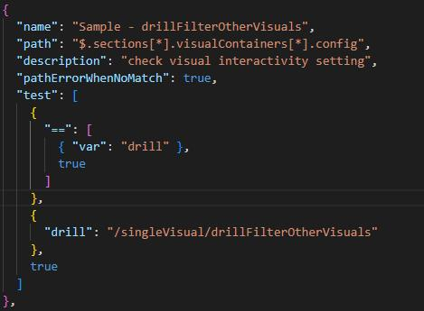
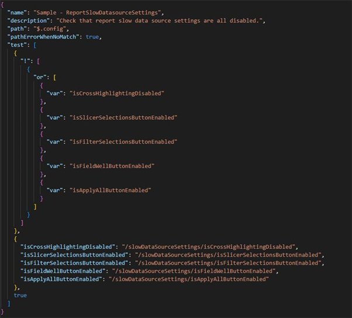
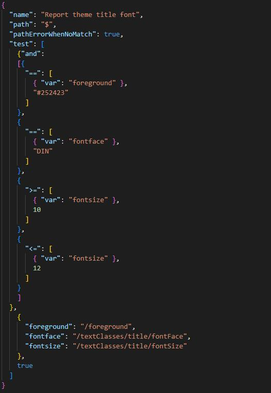
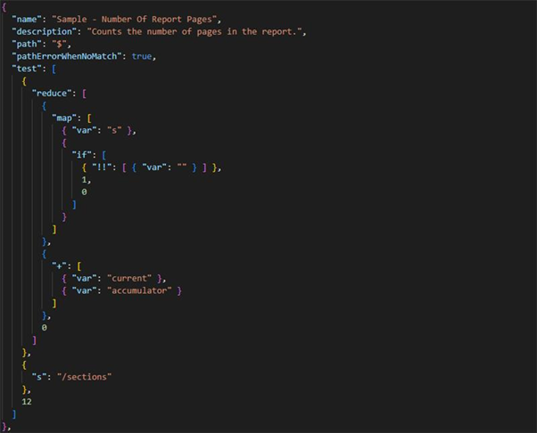
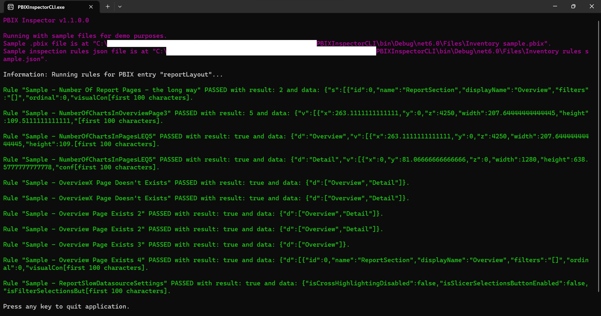

# VisOps with PBIX Inspector (i.e. automated visual layer testing)

***NOTE***: This is a personal side project that is not supported by Microsoft. Parsing the contents of a Power BI Desktop file (.pbix) is not supported either.

## Intro

So we've DevOps, MLOps and DataOps... but why not VisOps? How can we ensure that business intelligence reports' charts and visuals are published in a consistent state e.g. are chart titles displayed? Is the logo placed in a consistent location on each report page? With Microsoft Power BI, visuals are placed on a canvas and formatted as desired, images may be included and theme files referenced. Testing the consistency of the visuals output is typically a manual process. However because a Power BI .pbix file is packaged as an archive (.zip) file it is possible to unzip it and read the entries within. In particular the visuals layout definition and any associated theme are in json format. However upon new releases of Power BI Desktop and Service, the visual layout's json schema definition may introduce changes without warning to include new features for example. Therefore an automated visual layout inspection or testing tool should be resilient to change. PBIX Inspector provides the ability to define fully configurable testing rules (themselves written in json format) powered by Greg Dennis's Json Logic .NET implementation, see https://json-everything.net/json-logic. Currently the PBIX Inspector's test results are written to a console app (see screenshot below) with future plans to integrate it in DevOps operations also including formatted test result outputs.

## Examples

Run PBIX inspector by passing in PBIX file path and Json rules filepath as shown in the following example: 
```C:\> PBIXInspectorCLI.exe -pbix "Adventure Works.pbix" -rules "Adv Works rules.json"```

If run without any parameters PBIX inspector will use sample PBIX and rules files under the "Files" folder. 

See rules examples below.

- Check that certain types of charts have both axes titles displayed:


- Check visuals interactivity setting:


- Check that slow data source settings are all disabled:


- Check report theme title font attributes:


- Check the number of report pages (could also wrap this in a less than "<" test to ensure the number of pages in report are below a certain number for performance reasons for example) - showcasing the ability to express complex logic:


Here's a sample console output:
