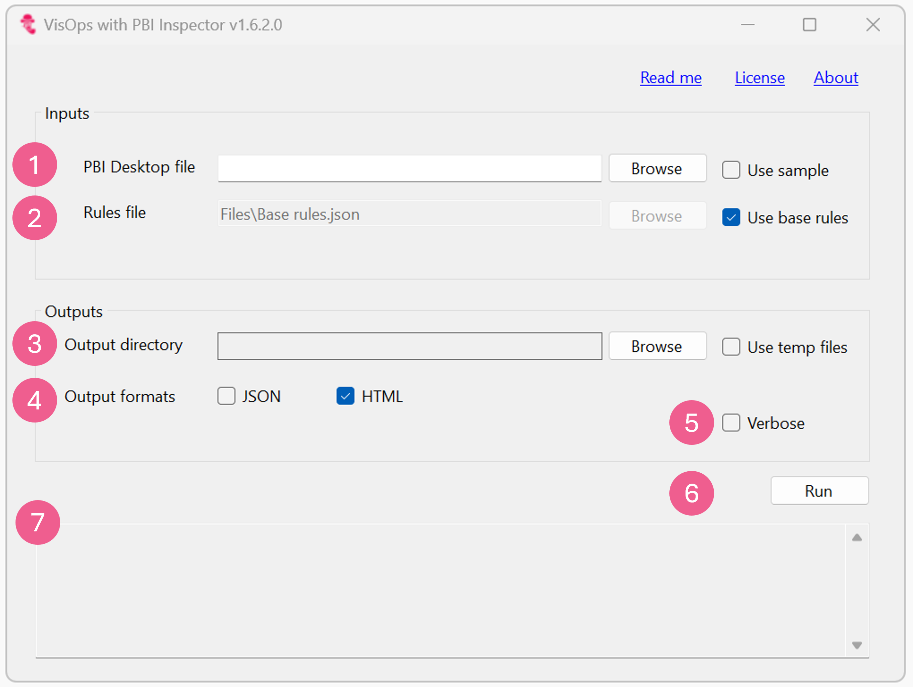

# VisOps with PBI Inspector (i.e. automated visual layer testing for Microsoft Power BI.)

***NOTE***: This is a personal side project that is not supported by Microsoft. Parsing the contents of a Power BI Desktop file (.pbix) is not supported either. 

*Update*: Release v1.2.0.0 of PBI Inspector can now inspect files in the new PBIP format (see announcement at https://powerbi.microsoft.com/en-us/blog/deep-dive-into-power-bi-desktop-developer-mode-preview/). At some point this project's name will be updated from "PBIX Inspector" to something that better reflects this change. 

## <a name="contents"></a>Contents

- [Intro](#intro)
- [Base rules](#baserulesoverview)
- [Graphical user interface](#gui)
- [Command line](#cli)
- [Interpreting results](#results)
- [Custom rules examples](#customrulesexamples)

## <a id="intro"></a>Intro

So we've DevOps, MLOps and DataOps... but why not VisOps? How can we ensure that business intelligence charts and other visuals within report pages are published in a consistent, performance optimised and accessible state? For example, is the logo placed in a consistent location on each report page? Are chart titles displayed? Is alternative text defined on visuals for use by screen readers? Are charts kept lean so they render quickly? etc.

With Microsoft Power BI, visuals are placed on a canvas and formatted as desired, images may be included and theme files referenced. Testing the consistency of the visuals output has thus far typically been a manual process. However because a Power BI .pbix file is packaged as an archive (.zip) file it is possible to unzip it and read the entries within. More recently, a [new Power BI Project file (.pbip) was introduced](https://powerbi.microsoft.com/en-us/blog/deep-dive-into-power-bi-desktop-developer-mode-preview/) for improved source control and, as it happens, better testability as far as PBI Inspector is concerned. In both cases, the visuals layout definition  and any associated theme are in json format and therefore readable by both machines and humans. However upon new releases of Power BI, the visual layout's json schema definition may introduce changes without warning to include new features for example. Therefore an automated visual layout inspection or testing tool should be resilient to such changes. PBI Inspector provides the ability to define fully configurable testing rules (themselves written in json format) powered by Greg Dennis's Json Logic .NET implementation, see https://json-everything.net/json-logic. 

## <a id="baserulesoverview"></a>Base rules

While PBI Inspector supports custom rules, it also includes the following base rules defined at ```"Files\Base rules.json"```, some rules allow for user parameters:

1. Remove custom visuals which are not used in the report (no user parameters)
2. Reduce the number of visible visuals on the page (set parameter ```paramMaxVisualsPerPage``` to the maximum number of allowed visible visuals on the page)
3. Reduce the number of objects within visuals (override hardcoded ```4``` parameter value the the maximum number of allowed objects per visuals)
4. Reduce usage of TopN filtering visuals by page (set ```paramMaxTopNFilteringPerPage```)
5. Reduce usage of Advanced filtering visuals by page (set ```paramMaxAdvancedFilteringVisualsPerPage```)
6. Reduce number of pages per report (set ```paramMaxNumberOfPagesPerReport```)
7. Avoid setting ‘Show items with no data’ on columns (no user parameters)
8. Tooltip and Drillthrough pages should be hidden (no user parameters)

Before modifying parameters, you may wish to either take a copy of the file at ```"Files\Base rules.json"``` within your local PBI Inspector deployment folder. If you need a fresh copy, see the PBI Inspector releases in Github at https://github.com/NatVanG/PBIXInspector/releases.

To disable a rule, edit the rule json to specify ```"disabled": true```. At runtime PBI Inspector will ignore any disabled rule.

Currently these changes need to be made directly in the rules file json, however the plan is to provide a more intuitive user interface in upcoming releases of PBI Inspector.

## <a id="gui"></a>Run from the graphical user interface (GUI)

Running ```PBIXInspectorWinForm.exe``` presents the user with the following interface: 



1. Browse to your local PBI Desktop File in either the PBIP "report.json" or PBIX file "*.pbix" format. Alternately to try out the tool, select "Use sample".
2. Either use the base rules file included in the application or select your own.
3. Use the "Browse" button to select an output directory to which the results will be written. Alternatively, select the "Use temp files" check box to write the resuls to a temporary folder that will be deleted upon exiting the application.
4. Select output formats, either JSON or HTML or both. To simply view the test results in a formatted page select the HTML output.
5. Select "Verbose" to output both test passes and fails, if left unselected then only failed test results will be reported.  
6. Select "Run". The test run log messages are displayed at the bottom of the window. If "Use temp files" is selected (or the Output directory field is left blank) along with the HTML output check box, then the browser will open to display the HTML results.
7. Any test run information, warnings or errors are displayed in the console output textbox.

## <a id="cli"></a>Run from the command line 

To inspect a PBIP file using the samples included in the [release files](https://github.com/NatVanG/PBIXInspector/releases), use the following command line: ```PBIXInspectorCLI.exe -pbip "Files\pbip\Inventory sample.pbip" -rules "Files\Base rules.json"```

To inspect a PBIX file using the samples included in the [release files](https://github.com/NatVanG/PBIXInspector/releases), use the following command line: 
```PBIXInspectorCLI.exe -pbix "Files\Inventory Sample.pbix" -rules "Files\Base rules.json"```

All command line parameters are as follows:

```-pbip filepath```: Optional. The filepath of the Power BI Desktop file to be inspected. If not specified then the sample PBIP file at "Files\pbip\Inventory Sample.pbip" will be inspected.

```-pbix filepath```: Optional. The filepath of the Power BI Desktop file to be inspected. If not specified then the sample PBIP file at "Files\Inventory Sample.pbix" will be inspected.

```-rules filepath```: Optional. The filepath to the rules file. If not specified, then base rules at "Files\Base rules.json" will be used.

```-verbose true|false```: Optional, true by default. If false then only rule violations will be shown otherwise all results will be listed.

```-output directorypath```: Optional. Writes results to the specified directory, any existing files will be overwritten. If not supplied then a temporary directory will be created in the user's temporary files folder. 

```-formats CONSOLE,JSON,HTML,PNG```: Optional. Comma-separated list of output formats. **CONSOLE** writes results to the console output, **JSON** writes results to a Json file, **HTML** writes results to a formatted Html page and **PNG** draws report pages wireframes clearly showing any failing visuals. If not specified "CONSOLE" will be used and results written to the console output only. If no output directory is specified and the HTML format is specified, then a browser page will be opened to display the HTML results.

If run without any parameters PBIX inspector will use the sample PBIP and and base rules file under the application's "Files" directory:

```PBIXInspectorCLI.exe```

## <a id="results"></a>Interpreting results

Depending on user selections or CLI arguments, the output will consist of either a JSON file or an HTML document or both. If a verbose output was requested, then results for both test passes and failures will be reported. The JSON output is intended to be consumed by a subsequent process, for example a Power BI report may be created that uses the JSON file as a data source and visualises the PBI Inspector test results. The HTML page is a more readable format for humans which also includes report page wireframe images when tests are at the page level. These images are intended to help the user identify visuals that have failed the test such as the example image below. In this example both the coloured barChart and columnChart visuals have failed a given test. The PBI Inspector logo is also displayed at the centre of each failing visuals as an additional identification aid when the wireframe is busy. 


Visuals with a dotted border are visuals hidden by default as the following example:


Finally please note that currently page wireframes are only created in a 16:9 aspect ratio so custom report page sizes including tooltip pages may not render as expeected as shown in the following tooltip page example. This will be addressed in a subsequent release.


## <a id="customrulesexamples"></a>Custom Rules Examples

*Please note that this section is not a guide to creating custom rules, just a very high-level overview and some examples for now. I intend to write such a guide in the near future.*

A PBI Inspector test is written in json and is in in three parts:
1. The [JSON Logic](https://json-everything.net/json-logic) rule
2. Some data mapping logic
3. The expected result

Besides the base rules defined at ```"Files\Base rules.json"```, see other rules examples below (included in the sample rules file at ```"Files\Inventory rules samples.json"```). 

- Check that certain types of charts have both axes titles displayed (this is quite an old example, it would be better to have a page outer loop otherwise a test result is generated for each visual of the report):

```
 {
            "name": "Sample - show visual axes titles",
            "description":"Check that certain charts have both axes title showing.",
            "disabled": false,
            "forEachPath": "$.sections[*]",
            "forEachPathName": "$.name",
            "forEachPathDisplayName": "$.displayName",
            "path": "$.visualContainers[*].config",
            "pathErrorWhenNoMatch": true,
            "test": [
                {
                  "map": [
                    {
                      "filter": [
                        {
                          "var": "q"
                        },
                        {
                           "if": [
                              { "in": [ { "var": "singleVisual.visualType" }, ["lineChart", "barChart", "columnChart", "clusteredBarChart"]] },
                              { "==": [ {"==": [ { "var": "singleVisual.objects.categoryAxis.0.properties.showAxisTitle.expr.Literal.Value" }, { "var": "singleVisual.objects.valueAxis.0.properties.showAxisTitle.expr.Literal.Value" }]}, "true" ] },
                              false
                            ]
                        }
                      ]
                    },
                    {
                      "var": "name"
                    }
                  ]
                },
                {
                  "q": "."
                },
                []
              ]
          }
```

- Check that charts are wider than they are tall (for fun or seriously):

```
{
            "name": "Sample - charts wider than tall",
            "description": "Want to check that your charts are wider than tall?",
            "disabled": false,
            "forEachPath": "$.sections[*]",
            "forEachPathName": "$.name",
            "forEachPathDisplayName": "$.displayName",
            "path": "$.visualContainers[*].config",
            "pathErrorWhenNoMatch": false,
            "test": [
                {
                  "map": [
                    {
                      "filter": [
                        {
                          "var": "q"
                        },
                        {
                           "<":[{"var":"width"}, {"var":"height"}]
                        }
                      ]
                    },
                    {
                      "var": "name"
                    }
                  ]
                },
                {
                  "q": "."
                },
                []
              ]
          }
```

- Check that slow data source settings are all disabled:

```
{
          "name": "Sample - ReportSlowDatasourceSettings",
          "disabled": true,
          "description": "Check that report slow data source settings are all disabled.",
          "path": "$.config",
          "pathErrorWhenNoMatch": true,
          "test": [
            {
              "!!": [
                {
                  "or": [
                    {
                      "var": "isCrossHighlightingDisabled"
                    },
                    {
                      "var": "isSlicerSelectionsButtonEnabled"
                    },
                    {
                      "var": "isFilterSelectionsButtonEnabled"
                    },
                    {
                      "var": "isFieldWellButtonEnabled"
                    },
                    {
                      "var": "isApplyAllButtonEnabled"
                    }
                  ]
                }
              ]
            },
            {
              "isCrossHighlightingDisabled": "/slowDataSourceSettings/isCrossHighlightingDisabled",
              "isSlicerSelectionsButtonEnabled": "/slowDataSourceSettings/isSlicerSelectionsButtonEnabled",
              "isFilterSelectionsButtonEnabled": "/slowDataSourceSettings/isFilterSelectionsButtonEnabled",
              "isFieldWellButtonEnabled": "/slowDataSourceSettings/isFieldWellButtonEnabled",
              "isApplyAllButtonEnabled": "/slowDataSourceSettings/isApplyAllButtonEnabled"
            },
            true
          ]
        }
```
